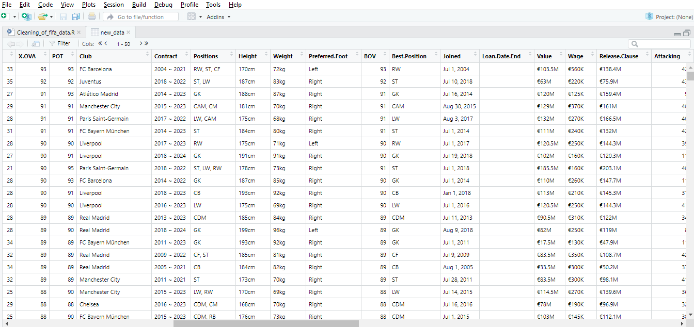

# FIFA-21-Data-Cleaning-Using-R


While growing up, my favorite sport was football. Then at home, I watched the game together with my parents, siblings, and some other members of the family. The time spent together doing this was a memorable one. During my secondary school days, I was part of the team that represented my school in football games. Then I was good at being a keeper and sometimes I played as a midfielder :smile:. What a memory! 

In short, my love for football made me jump on this data-cleaning challenge

## Background

This challenge was organized by [ChinosoPromise](https://twitter.com/PromiseNonso_) and [VicSomadina](https://twitter.com/vicSomadina) for data newbies, intermediate, and pro data analysts to test their data cleaning knowledge or to learn how to clean dirty and messy data as the case may be.
The uncleaned data was obtained from [Kaggle](https://www.kaggle.com/datasets/yagunnersya/fifa-21-messy-raw-dataset-for-cleaning-exploring).

I decided to use R programming language for the cleaning in other to improve my R skills.

## About the dataset
The dataset contains information on players who partook in FIFA 2021 football. There are 18979 rows and 77 columns in the datasets, that's a lot of columns, right?
A total of 19 columns were cleaned/modified

## Data Cleaning Process

The table below shows a preview of how the data looks before cleaning



The notable cleaning performed on the dataset is described below

- **Data Load**

The CSV file was loaded into RStudio using the code below:

```r
new_data <- read.csv("C:/Users/Raufr/OneDrive/Desktop/R/Data Cleaning with R/fifa21 raw data v2.csv")
view(new_data)
```
- **Club Column**

As seen in the above picture of the dirty data, this column contains white and trailing spaces, so I used the gsub() function to remove white space
```r
-- Removing white spaces from the club column
new_data$Club<- gsub("\\s+", "", new_data$Club)
```
- **Contract column**
 
This column contains information about two separate years. The column was used to create a “contract type” column to show if a player is on contract, on loan, or Free.
```r
#Create a Contract_type to indicate if players are on contract, on loan, or free
new_data <- new_data %>%
  mutate(Contract_type = case_when(
    grepl("~",Contract) ~ "Contract",
    grepl("L", Contract) ~ "On Loan",
    grepl("F",Contract) ~ "Free") )
unique(new_data$Contract_type)
```
Then the column was split into “Contract Start”, and “Contract_ End” columns to capture the start and existing date of players that are on contract
```r
#split contract column into Contract_Start and Contract_End Columns 
new_data <- separate(new_data,Contract, into = c('Contract_Start','Contract_End'),sep = "~")
```

- **Height column**

This column contains height measured in cm, feet, and inches and we need to adopt just a unit of measurement which is centimeters, The code was written to convert values that are in inches to cm, and values in feet were converted to cm as well. Cleaning this column was a bit tough because some rows contain values both in inches and feet which need to be converted separately before adding them together. Values that are in inches were multiplied by 30.48, while values in feet were multiplied by 2.54 and both numbers were added together. The data type was also changed to numeric
```r
# Cleaning height column
v <<- 1
for (val in new_data$Height) {
  if (grepl("cm",val)) {
    val <- gsub("cm","", val)
    new_data$Height[v] = val
  }
  else if (grepl("'",val)){
    val <- gsub("'","", val)
    val <- gsub('"',"",val)
    
    if (as.numeric(val) < 100){
      wholenumber <- floor(as.numeric(val)/10)
      decimal <- as.numeric(val) - floor(as.numeric(val)/10) * 10
      val <- wholenumber * 30.48 + (decimal) * 2.54
    }
    else
    { 
      wholenumber <- floor(as.numeric(val)/100)
      decimal <- as.numeric(val) - floor(as.numeric(val)/100) * 100
      val <- wholenumber * 30.48 + (decimal) * 2.54
    }
    new_data$Height[v] = val
  }
  else{}
  v <- v+1
}
new_data$Height <- as.numeric(new_data$Height)  #convert height to number
print(new_data$Height)
```

- **Weight Column**
  
The column is similar to the height but less technical because the values in this column contain just two units, kg, and lbs. The values in lbs were converted to kg by multiplying them with 0.454 and unwanted characters were removed. The data type was also changed to numeric
```r
# Cleaning weight column
v <<- 1
for (val in new_data$Weight) {
  
  if (grepl("kg",val)){
    val <- gsub("kg","", val)
    new_data$Weight[v] = val
  }
  else if (grepl("lbs",val)){
    val <- gsub("lbs","", val)
    new_data$Weight[v] = as.numeric(val) * 0.454
  }
  else{}
  v <- v+1
}
new_data$Weight <- as.numeric(new_data$Weight)  #convert weight column to numeric
``` 

- **The Value, Wage, and Released Clause columns**
  
The columns contain special characters (€, K, M). The special characters were removed and then multiplied the values with K by “1000” and M by “1,000,000”. The values were converted to dollars by multiplying them by 1.06 (using the £ to $ being the #official rate as of March 16, 2023). Datatypes were also changed to numeric
```r
# Clean the Value Column
new_data$Value <- gsub("€","", new_data$Value)
v <<- 1
for (val in new_data$Value) {
  
  if (grepl("M",val)){
    val <- gsub("M","", val)
    new_data$Value[v] = as.numeric(val) * 1000000
  }
  else if (grepl("K",val)){
    val <- gsub("K","", val)
    new_data$Value[v] = as.numeric(val) * 1000
  }
  else{}
  v <- v+1
}
# convert from euros to dollars
new_data$Value <-as.numeric(new_data$Value)
new_data$Value <- new_data$Value * 1.06       #official rate as at March 16 2023
```
```r
# Cleaning Wage Column
new_data$Wage <- gsub("€","", new_data$Wage)
v <<- 1
for (val in new_data$Wage) {
  
  if (grepl("M",val)){
    val <- gsub("M","", val)
    new_data$Wage[v] = as.numeric(val) * 1000000
  }
  else if (grepl("K",val)){
    val <- gsub("K","", val)
    new_data$Wage[v] = as.numeric(val) * 1000
  }
  else{}
  v <- v+1
}
# convert from euros to dollars
new_data$Wage <- as.numeric(new_data$Wage)
new_data$Wage <- new_data$Wage * 1.06
```
```r
#Cleaning Released.Clause column
new_data$Release.Clause <- gsub("€","", new_data$Release.Clause)
v <<- 1
for (val in new_data$Release.Clause) {
  if (grepl("M",val)){
    val <- gsub("M","", val)
    new_data$Release.Clause[v] = as.numeric(val) * 1000000
  }
  else if (grepl("K",val)){
    val <- gsub("K","", val)
    new_data$Release.Clause[v] = as.numeric(val) * 1000
  }
  else{}
  v <- v+1
}
# convert from euros to dollars
new_data$Release.Clause <-as.numeric(new_data$Release.Clause)
new_data$Release.Clause <- new_data$Release.Clause * 1.06
```

- **WF, SM, and IR columns**
  
These columns contain the ratings of the player's weak foot, Skill Moves, and Injury ratings on a scale of 1 to 5. The columns consist of special characters (★) as seen below


The ★ was removed and the data type of each column was changed to an integer
```r
#remove special characters from W.F.SM, and IR columns
new_data$W.F <- gsub("★","",new_data$W.F)
new_data$W.F <- gsub(" ","",new_data$W.F)
new_data$SM <- gsub("★","",new_data$SM)
new_data$SM <- gsub(" ","",new_data$SM)
new_data$IR <- gsub("★","",new_data$IR)
new_data$IR <- gsub(" ","",new_data$IR)

#Convert W.F, SM, and IR columns to integer
new_data$W.F <-as.integer(new_data$W.F)
new_data$SM <-as.integer(new_data$SM)
new_data$IR <-as.integer(new_data$IR)
```

- **Hits Column**
  
There are null values and a special character K in this column.
The null values were removed while values that contain K were multiplied by “1000” and the data type was converted to numeric.
```r
#cleaning Hits column
v <<- 1 
for (val in new_data$Hits) {
  
  if (grepl("K",val)){
    val <- gsub("K","", val)
    new_data$Hits[v] = val = as.numeric(val) * 1000
  }
  else{}
  v <- v+1
} 
new_data$Hits <-as.numeric(new_data$Hits)   #convert Hit Column to number
unique(new_data$Hits)
new_data<- new_data %>% #replacing null values in the Hits column with 0
  mutate(Hits=if_else(is.na(Hits), 0, Hits))
```
- **BOV, X.OVA, and POT columns**
  
The values of these columns are integers but they need to be represented as percentages.
Approach: The column was divided by 100 and the “Percent” function was used to format the values as percentages.
```r
#Divide BOV, OVA, and POT columns by 100 to change the columns to numeric
#then convert to percentage(%)
new_data$POT<- new_data$POT/100
new_data$X.OVA<- new_data$X.OVA/100
new_data$BOV<- new_data$BOV/100

# Convert them to percentages using the "percent" function 
new_data$POT<- percent(new_data$POT, accuracy=1)
new_data$X.OVA<- percent(new_data$X.OVA, accuracy=1)
new_data$BOV<- percent(new_data$BOV, accuracy=1)
```

- **Inconsistent Column names**
 
There are inconsistencies in some column names such as LongName, X.OVA, and others. These columns were renamed to follow the naming convention.
```r
#rename columns
new_data<- new_data %>%
  rename(Full_Name=LongName, Overall_Rating=X.OVA, Potential=POT, Height_cm= Height, Weight_kg=Weight,
         Best_Overall=BOV,Injury_Rating= IR, Pass_Accuracy=PAS, Shooting_Attribute=SHO,Pace=PAC)
```
## After cleaning

Below is a preview of how the data looks after cleaning


## Conclusion
Finally, the cleaned dataset was saved as a CSV file and exported and it can be downloaded from [here](https://github.com/Ratafar22/FIFA-21-Data-Cleaning-Using-R/blob/main/Fifa_data.Cleaned.csv) for anyone who has an interest in working with it.

Indeed, it was a real challenge that required critical thinking and a lot of research, especially with the use of R. But in all, the knowledge and experience gained during this challenge cannot be quantified
